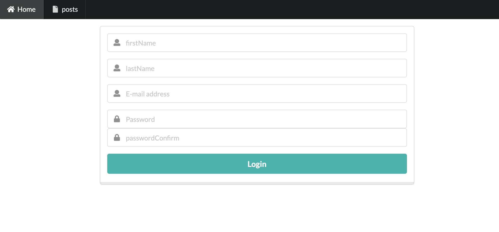
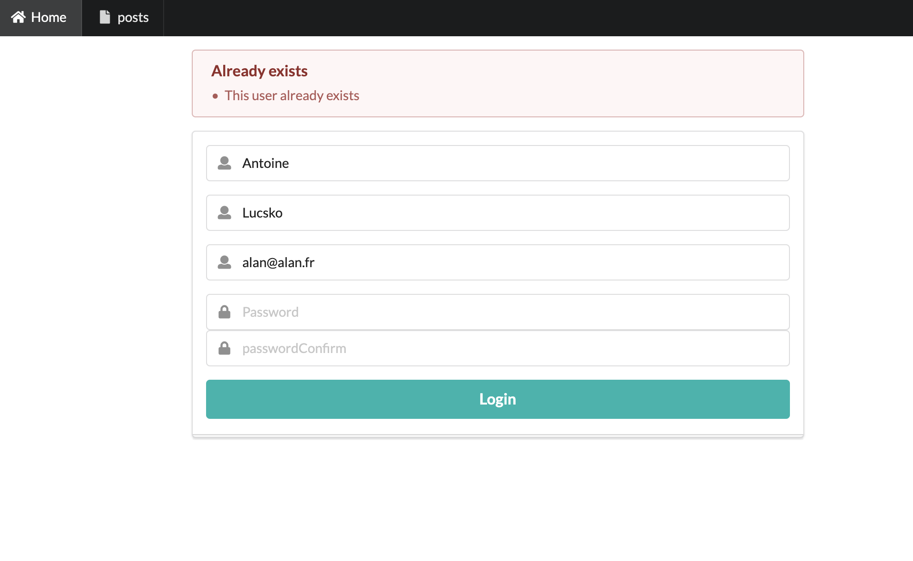
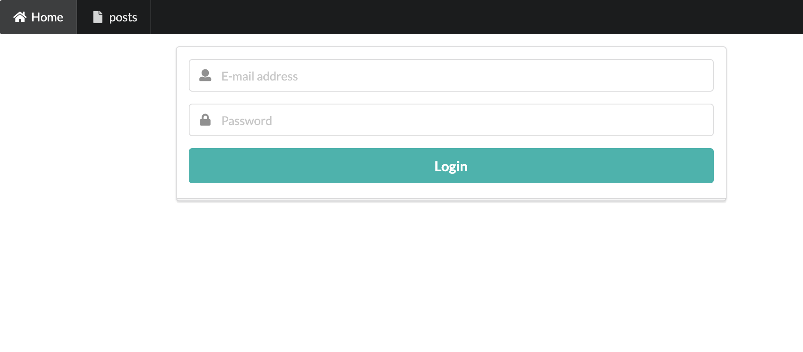

# Formulaire et validation

Nous allons dans cette partie approfondir la notion d'authentification et de gestion d'utilisateurs. Vous avez la journée pour réaliser le TP proposé ci-après.

Il faudra rendre votre travail à la fin de la journée sur un dépôt Git. Une première partie obligatoire est demandée et une autre est facultative.

## Objectifs

Pour information, il existe des solutions pour gérer de l'authentification avancée, mais nous ne les aborderons pas dans ce cours.

Pour plus de détails à ce sujet, vous pouvez consulter le package **Passport** : http://www.passportjs.org/packages/passport-local/

---

Vous devez créer une page d'enregistrement d'un utilisateur, vérifiez que celui-ci n'existe pas déjà en base de données; puis une fois l'utilisateur enregistré, il est redirigé vers la page de login. Il devra alors s'authentifier pour accéder à la page Dashboard sécurisée.

Dans ce TP vous devez partir du modèle Express **model_complet_02**, dans le dossier Models_app. Une fois votre code en place vous devez le mettre sur votre serveur Git et transmettre l'adresse du dépôt à votre formateur.

Vous serez noté sur la qualité algorithmique de votre code ainsi que la maîtrise des notions abordées en cours.

Vous utiliserez **semantic-ui** pour l'aspect graphique de l'application.

## 01 Créez le modèle User 

Vous utiliserez MongoDB pour la persistance des données.

Le modèle `User` sera créé dans la collection **users** dans la base de données students.

Voici la structure d'un document Utilisateur sur lequel vous vous baserez pour faire le Schéma mongoose :

```js
{
    firstName  // type String, obligatoire
    lastName  // type String, obligatoire
    email  // type String, obligatoire
    password  // type String, obligatoire
}
```

Le mot de passe devra être encodé en **HMAC SHA-256**. Le `secret` utilisé devra être défini dans une variable d'environnement.

Consultez cet article pour plus d'informations sur la création de HMAC avec Node.js et le module `crypto` : https://melvingeorge.me/blog/create-sha256-hash-nodejs

## 02 La page permettant d'ajouter un User

La page principale proposera le formulaire permettant d'enregistrer un nouvel utilisateur :



Vous devez vérifier les points suivants avant l'enregistrement :

- Aucun des champs ne devra être vide, gérez les erreurs de saisies.

- Le choix du mot de passe devra être confirmé, gérez les erreurs de saisies.

S'il y a des erreurs de saisies, on ré-affichera le même formulaire avec les messages d'erreurs appropriées.


## 03 L'utilisateur existe

Vous devez également vérifier en base de données que l'utlisateur n'existe pas déjà.



Exemple avec la méthode `.findOne` de Mongoose pour faire une recherche à partir d'un modèle :

```js
// UsUserModeler est votre modèle mongoose
const user = await UserModel.findOne({ email : email });

if (doc) {
    // User exists
} else {

}
```

## 04 Page Login

Une fois enregistré, l'utilisateur sera re-dirigé vers la page login.



L'utilisateur se connectera et sera alors re-dirigé, si tout se passe bien, vers la page Dashboard. Sinon on lui ré-affichera la page de login.

## 07 Middleware sécurité

Mettez en place un middleware de sécurité pour protéger la page dashboard. Seul un utilisateur connecté pourra consulter cette page.

## 06 flash message (facultatif)

Si vous avez le temps, vous essaierez de mettre en place des "flash messages".

Un flash message survient à la suite d'une opération quelconque. Cela peut-être un message de succès, d'avertissement, d'information ou d'erreur.

```bash
npm install express-session
npm install connect-flash
```

Importez les classes suivantes (dépendances) :

```js
import session from "express-session";
import flash from "connect-flash";
```

Dans le fichier server.js vous devez définir les variables de session et vos flash messages comme suit. 

```js
app.use(session({ /* … */ }));

// "flash" doit impérativement être défini APRÈS le middleware de session
app.use(flash());

app.use((req, res, next) => {
    res.locals.flash_message = req.flash("success_message");
    res.locals.messages = [];
    next();
});
```

Puis dans votre code pour gérer les flash messages vous écrirez :

```js
export default (req, res) => {
    req.flash('flash_message', 'Je suis un flash message');
}
```
